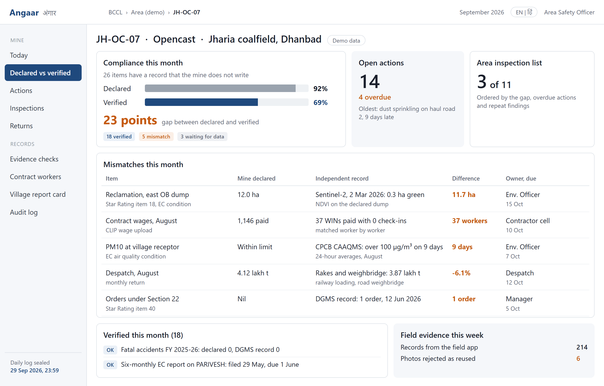
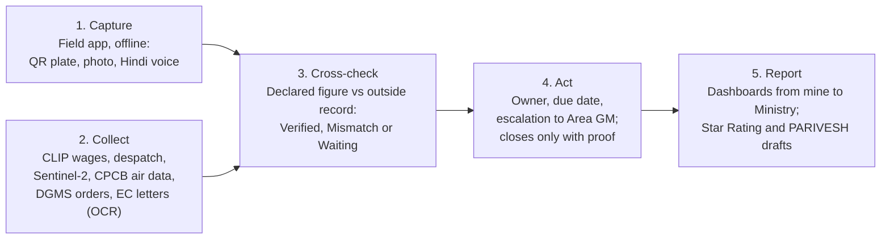
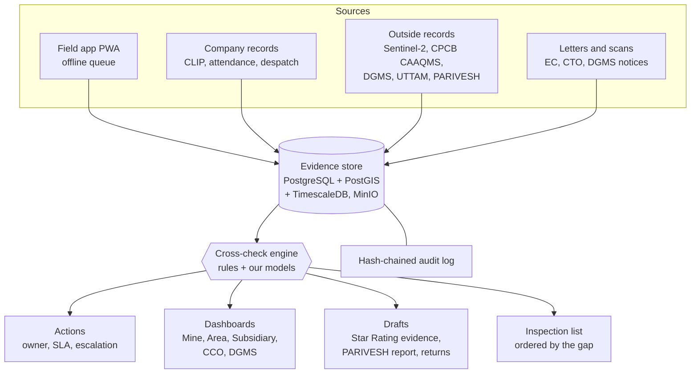
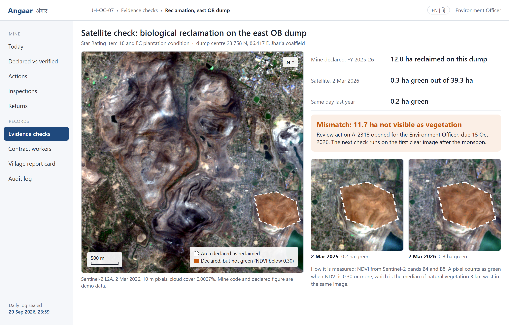
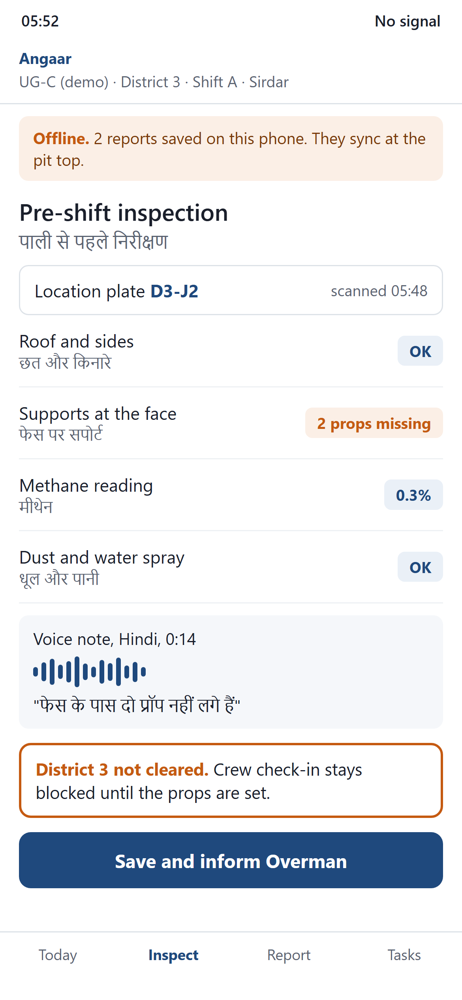
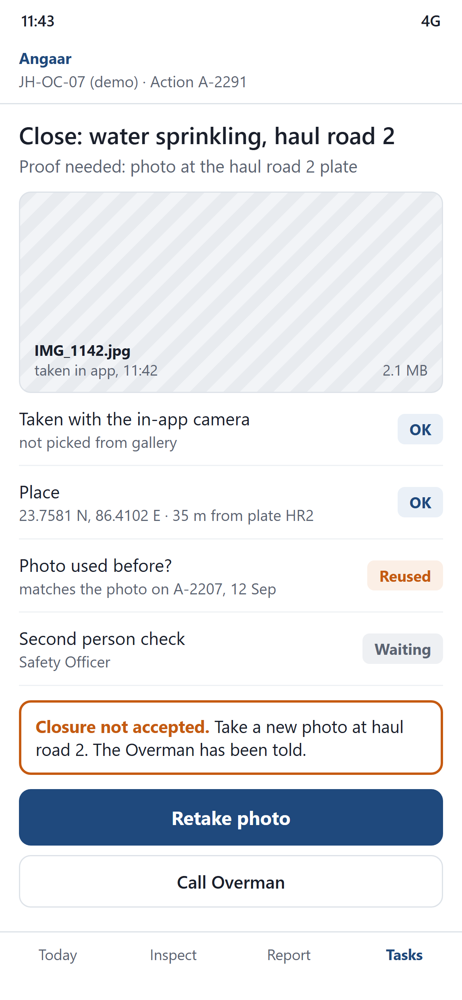
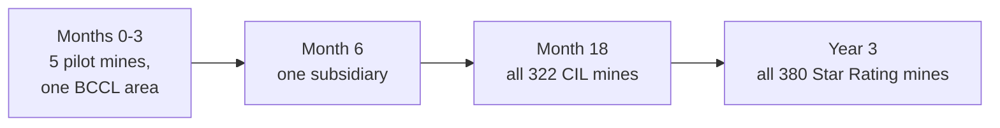

# Angaar (अंगार)

**Coal mine compliance, checked against records the mine does not write.**

Angaar is a web and field app for coal mine governance. It checks what a mine *declares* (in the Star Rating, EC compliance reports, monthly returns and wage uploads) against records the mine does not type itself: satellite images, CPCB air quality stations, railway and weighbridge despatch, CLIP wage data, third-party coal sampling and DGMS orders. Every mine gets two scores, **Declared** and **Verified**. The gap between them tells DGMS, the Coal Controller's Organisation (CCO) and Coal India where to look first.

| | |
|---|---|
| Event | Smart India Hackathon 2026 |
| Problem statement | **SIH26024**: AI-Based Smart Governance and Compliance Monitoring System for Coal Mines |
| Organisation | Ministry of Coal (department: Coal India Limited) |
| Theme / category | Smart Automation / Software |
| Team | **Computer Smashers** (Team ID 178955) |
| Idea deck | [`presentation/Angaar_SIH26024_Computer_Smashers.pdf`](presentation/Angaar_SIH26024_Computer_Smashers.pdf) |



---

## Contents

1. [The problem](#1-the-problem)
2. [Our idea: Declared vs Verified](#2-our-idea-declared-vs-verified)
3. [How Angaar works](#3-how-angaar-works)
4. [The cross-checks](#4-the-cross-checks)
5. [Who uses it and what they get](#5-who-uses-it-and-what-they-get)
6. [Screens](#6-screens)
7. [Satellite check on real data](#7-satellite-check-on-real-data)
8. [Technology](#8-technology)
9. [Feasibility, risks and rollout](#9-feasibility-risks-and-rollout)
10. [Impact](#10-impact)
11. [Repository structure](#11-repository-structure)
12. [Research and references](#12-research-and-references)

---

## 1. The problem

Governance in Indian coal mining is spread across subsidiaries, mines, contractors and regulators (DGMS for safety, MoEFCC and the State Pollution Control Boards for environment, CCO for production and the Star Rating). Compliance, inspections, safety observations, production, attendance, contract labour and grievances are tracked on paper, in spreadsheets and in separate portals. The full problem statement is in [`docs/PROBLEM_STATEMENT.md`](docs/PROBLEM_STATEMENT.md).

The condition underneath all of this: **most compliance data is written by the same people it evaluates.**

- In the Ministry of Coal's **Star Rating for 2022-23, 380 mines rated themselves**. Only the top 10% (about 38 mines) got a site visit; the rest were reviewed online.
- The Star Rating opencast template has **50 items, and the mine types the "actual value" for every one of them**.
- Six-monthly EC compliance reports, monthly returns and contractor wage uploads are also self-declared.
- DGMS already assigns inspections by risk through the Shram Suvidha portal (since 2016), but the risk inputs are only as good as the data behind them.

## 2. Our idea: Declared vs Verified

Angaar treats every declared figure as a claim and looks for an independent "witness" for it.

- **Declared compliance**: the share of items the mine marks as compliant.
- **Verified compliance**: the share of those items that an outside record actually confirms.
- **The gap** (in points) is the signal. A mine that declares 92% but verifies 69% has a 23-point gap, and moves up the inspection list.

A mismatch is never a penalty by itself. It opens a review with an owner and a due date, and an officer closes every case.

## 3. How Angaar works



**Human control:** the software only flags a mismatch and the language model only drafts report text. An officer closes every case.

### Architecture



## 4. The cross-checks

| What the mine declares | Independent record | Example mismatch |
|---|---|---|
| Biological reclamation of dumps (Star Rating item 18, EC plantation condition) | Sentinel-2 NDVI inside the declared area | 12.0 ha declared, 0.3 ha green |
| Contract wages paid (CLIP upload) | Attendance and check-ins, matched worker by worker (WIN) | 37 workers paid with zero check-ins |
| Ambient air within limits (Star Rating item 9, EC condition) | CPCB CAAQMS station readings | PM10 over 100 µg/m³ on 9 days |
| Despatch in the monthly return (Star Rating item 27) | Railway rake loading and road weighbridge | 4.12 lakh t declared, 3.87 lakh t recorded |
| Coal grade (Star Rating item 29) | Third-party sampling results (UTTAM) | Grade slippage not shown in the return |
| EC compliance report filed on time (Star Rating item 13) | PARIVESH submission date | Filed after 1 June or 1 December |
| No Section 22 orders, accidents or injuries (Star Rating items 40, 43, 44, 45) | DGMS records | One Section 22 order not declared |
| Readings in shift registers | Variance over shifts | The same reading copied for 11 shifts |
| Inspection done | QR plate scans with time and place | Inspection logged without a visit |
| Worker fit to go underground | Vocational training and medical certificate dates | Expired certificate blocks check-in |

Field work adds its own proof: a closure photo must be taken in the app at the right QR plate, a reused photo is rejected (perceptual hash), and a second person verifies the fix.

## 5. Who uses it and what they get

| User | What Angaar gives them |
|---|---|
| Sirdar and Overman | Hindi forms that work with no signal underground, QR location plates, pre-shift district clearance before crew check-in |
| Contract workers | Paid days matched with days at work, every month; complaints by voice |
| Mine Manager and officers | One due-list of obligations and actions instead of separate registers and portals |
| Area, subsidiary and CIL | Every mine's gap, repeat problems and contractor record at a glance |
| DGMS and CCO | An inspection list ordered by the gap; evidence packs for the Star Rating |
| Villages near mines | Dust and reclamation claims checked against CPCB and satellite data |

## 6. Screens

Screens use demo data for a fictional mine (JH-OC-07). The satellite values are real.

| Mine view: declared vs verified | Satellite evidence check |
|---|---|
|  |  |

| Sirdar's pre-shift check, offline | Closure refused: reused photo |
|---|---|
|  |  |

The screens are plain HTML in [`screens/html`](screens/html): open any file in a browser.

## 7. Satellite check on real data

The reclamation check runs on free Sentinel-2 L2A images from the Earth Search STAC catalogue (no login needed).

| Date | Scene | Dump area | Green area (NDVI ≥ 0.30) |
|---|---|---|---|
| 2 Mar 2025 | `S2B_45QVG_20250302_0_L2A` | 39.3 ha | 0.2 ha |
| 2 Mar 2026 | `S2C_45QVG_20260302_0_L2A` (cloud 0.0007%) | 39.3 ha | 0.3 ha |

The dump is an overburden dump in Jharia coalfield (centre 23.758 N, 86.417 E). A pixel counts as green when NDVI is 0.30 or more, which is the median NDVI of natural vegetation 3 km west in the same image. The "12.0 ha declared" figure in the screen is demo data.

Run it yourself:

```bash
cd satellite-check
pip install -r requirements.txt
python satellite_check.py
```

Output:

```text
2025-03-02: dump area 39.3 ha, green (NDVI >= 0.3) 0.2 ha
2026-03-02: dump area 39.3 ha, green (NDVI >= 0.3) 0.3 ha
Declared reclaimed: 12.0 ha -> mismatch if green area is well below it
```

## 8. Technology

| Part | What we use | Who built it |
|---|---|---|
| Web and phone app | Next.js 15 PWA, Workbox offline cache, IndexedDB queue, QR scanner | Our code |
| Server | FastAPI (Python 3.12), Celery and Redis for nightly checks and deadlines | Our code |
| Database | PostgreSQL 16 with PostGIS and TimescaleDB, MinIO for photos | Open source, self-hosted |
| Checks and models | NDVI with rasterio, Isolation Forest, LightGBM with SHAP, TF-IDF classifier | Our code, our trained models |
| Outside models | Sentinel-2 images, Bhashini speech-to-text, Tesseract OCR, Llama 3.1 8B | External (Llama runs on our server) |
| Security and audit | Role-based login, SHA-256 hash-chained audit log, encrypted storage | Our code |

One codebase serves the office dashboard and the phone app: the web app installs on Android and keeps working offline, so there is no separate app-store release. It runs on NIC MeghRaj or a CIL data centre with no per-user licence fees.

## 9. Feasibility, risks and rollout

| Risk | How we handle it |
|---|---|
| **Data access**: CLIP, attendance and despatch data need CIL approval | Start on public data (Sentinel-2, CPCB, DGMS, Coal Directory) and CSV files from the pilot area |
| **Wrong results or downtime**: clouds, monsoon, sensor gaps, no network | Cloud mask and dry-season images; a mismatch opens a review, never a penalty; the app works offline |
| **Adoption**: Sirdars and Overmen are short of time and fear blame | Hindi voice, 3-tap forms, QR plates; results go to managers, not to the person who reported |



## 10. Impact

**Estimate (our calculation from public figures, not an official number):**

- 380 mines were rated in 2022-23; the top 10%, about **38**, got a site visit.
- 9 of the 50 opencast Star Rating items have an outside record.
- With Angaar: 380 mines × 12 months = **4,560 mine-checks a year** on those 9 items.
- Site visits still check all 50 items; Angaar tells them where to go first.

| | |
|---|---|
| **Social** | A hazard closes only with photo proof at the spot; contract workers' paid days are checked every month |
| **Economic** | Data entered once and reused for every return; fewer surprise orders |
| **Environmental** | Reclamation and dust checked every month, not once a year |
| **Beyond India** | Sentinel-2 images are free for every country and the rules are stored as data, so a coal mine in Indonesia, South Africa or Australia needs a new rule pack, not new code |

Scale in India: 380 Star Rating mines (2022-23), 322 Coal India mines (1 April 2023), 1,047.5 Mt of coal output in FY 2024-25.

## 11. Repository structure

```text
.
├── README.md                  this file
├── docs/
│   ├── PROBLEM_STATEMENT.md   SIH26024, word for word
│   ├── RESEARCH.md            facts, numbers and findings behind the idea
│   └── HANDOFF.md             project state and next steps for the team
├── presentation/
│   ├── Angaar_SIH26024_Computer_Smashers.pdf   deck to upload on the SIH portal
│   ├── Angaar_SIH26024_Computer_Smashers.pptx  editable deck
│   └── template/NMIET_SIH_2026_PPT_Template.pptx
├── screens/
│   ├── html/                  app screens as HTML (open in a browser)
│   └── png/                   the same screens as images
└── satellite-check/
    ├── satellite_check.py     the real Sentinel-2 reclamation check
    └── requirements.txt
```

## 12. Research and references

1. Star Rating of Coal Mines and the opencast evaluation template, Ministry of Coal: [starrating.coal.gov.in](https://starrating.coal.gov.in/faq.php), [Template_OC.pdf](https://starrating.coal.gov.in/policy/Template_OC.pdf)
2. Star Rating review, The Reporters' Collective, 27 Nov 2024: [reporters-collective.in](https://www.reporters-collective.in/trc/blinded-by-the-stars-a-govts-rating-scheme-is-helping-coal-miners-pat-their-own-back)
3. DGMS SANKET, coal mine accidents 2016-22: [dgms.net](https://dgms.net/Sanket%200404_2024.pdf)
4. DGMS at a Glance 2023, risk-based inspection through Shram Suvidha: [dgms.net](https://www.dgms.net/DGMS%20AT%20A%20GLANCE%202023.pdf)
5. Coal Directory of India 2024-25, Coal Controller's Organisation: [coalcontroller.gov.in](https://coalcontroller.gov.in/coal-directory-india)
6. Sentinel-2 L2A images, ESA Copernicus, via Earth Search: [earth-search.aws.element84.com](https://earth-search.aws.element84.com/v1)
7. CPCB CAAQMS air quality data: [airquality.cpcb.gov.in/ccr](https://airquality.cpcb.gov.in/ccr/)
8. UTTAM, third-party coal quality results, CIL: [uttam.coalindia.in](https://uttam.coalindia.in/sampling_process.html)
9. PARIVESH, six-monthly EC compliance: [parivesh.nic.in](https://parivesh.nic.in)
10. OSH Code 2020 in force from 21 Nov 2025, PIB: [pib.gov.in](https://www.pib.gov.in/PressReleasePage.aspx?PRID=2192802)
11. CLIP contract labour portal, CIL: [clip.cmpdi.co.in](https://clip.cmpdi.co.in/home)
12. Ministry of Coal Year End Review 2025 (coal output FY 2024-25), PIB: [pib.gov.in](https://www.pib.gov.in/PressReleasePage.aspx?PRID=2213723)

Public sources (3 to 9) are used directly. CLIP wages, attendance and despatch (CIL) and inspection records (DGMS) connect through approved data sharing.

---

Built by **Computer Smashers** for Smart India Hackathon 2026.
